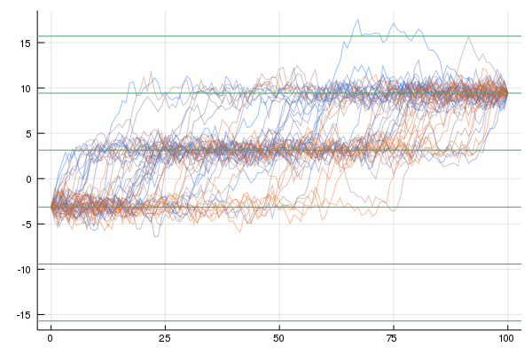
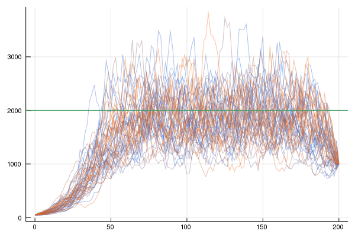
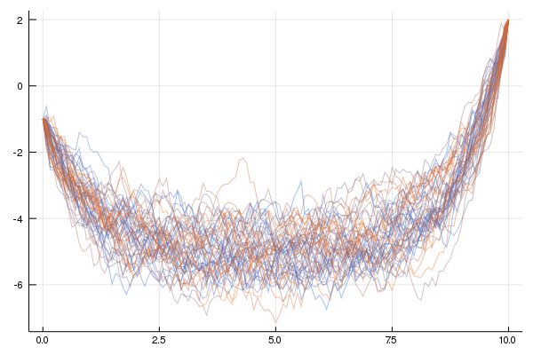
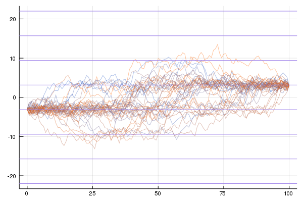

# ZZDiffusionBridge
ZigZag sampler is used to explore the conditional measure of a diffusion process. This measure lays in a high dimensional space (infinite dimensional) and could differ significantly from a Gaussian measure (which in our case is the reference measure). 


## Overview
The main function introduced (available [here](src/zz_sampler.jl)) is  

```julia
zz_sampler(X::AbstractModel, T::Float64, L::Int64, u::Float64, v::Float64, clock::Float64; θ = fill(1.0, 2<<L - 1))
```

It takes a diffusion model with its parameters, its initial and final points `u,v`, the truncation level of the infinite summation `L`, the final time of the ZigZag sampler `clock` and as optional input, the velocity vector for each coordinate. The function returns the skeleton of the ZigZag process with the real event times. This is given in the form of `Array{Skeleton, 1}`. 

### Structures
Three main types are defined ([here](src/types.jl)): 
1. the abstract type `::AbstractModel`, inheriting any specific diffusion model
2. the abstract type `::AbstractDependenceStructure` inheriting the types of dependences (for our application we have now two subtypes `::FullIndependence` and `::PartialIndependence`) acting as a flag
3. the abstract type `SamplingScheme` inheriting the types of sampling scheme (`::Regular` and `::PartialIndependence` ) acting as a flag
4. the type `System`, container of all the attributes necessary for the sampler

## Examples
We have three examples right now ([here](/scripts/examples) running the ZigZag sampler for three different SDEs. **how to run them:** easy, just download the repo and run the script in the folder src/examples 

## Developing the ZigZag for a new SDE
If you want to develop your own SDE, you need to:
1. define your  `::ModelName:<AbstractModel` containing the parameters (and optionally some parameters/vectors/matrices needed to the sampler which is better to precompute.)
2. define the function `λbar(n, S::System, X::ModelName , u, v)` and `λratio(n::Int64, S::System, X::ModelName, u::Float64, v::Float64, t::Float64)` (`λratio` only if the sampling scheme is `SubSampling`)
3. assign the flags for the sampler depending wheather the sampler is `Fullindependence` or `PartialIndependence`; `Regular` or `SubSampling`. This is done for example via the flag-funcitons

dependence_strucute(::ModelName) = FullIndependence()
sampling_scheme(::ModelName) = SubSampling()

## Faber-Schauder functions
The file [faber.jl](src/faber.jl) and [fs_expansion.jl](src/fs_expansion.jl) contains all the functions necessary to work with the Faber-Schauder functions and change of basis to finite elements. 

## Benchmark
An efficient implementation of the fully local Zig-Zag sampler is implemented in the official package (ZigZagBoomerang.jl)[https://github.com/mschauer/ZigZagBoomerang.jl]. We used it to test the performances of the Zig-Zag sampler agaist the Boomerang sampler and the MALA. The effective sample size is computed using functions implemented in [https://github.com/jbierkens/ICML-boomerang/]. 


## Results!

Sine SDE with alpha = 0.7



Exponential growth model with r = 0.1, b=0.1 K = 2000



Orstein-Uhlenbeck process with \mu = -5 and \nu= 1.0



Stochastic gradient Langevin dynamic for the sine SDE with alpha = 0.7, batch size = 2^(L-1) - 1 



## Literature
- Joris Bierkens, Sebastiano Grazzi, Frank van der Meulen, Moritz Schauer: A piecewise deterministic Monte Carlo method for diffusion bridges. 2020. [https://arxiv.org/abs/2001.05889].
- Joris Bierkens, Sebastiano Grazzi, Kengo Kamatani and Gareth Robers: The Boomerang Sampler. ICML 2020. [https://arxiv.org/abs/2006.13777]. 
- Moritz Schauer, Sebastiano Grazzi: ZigZagBoomerang.jl. 2020. [https://github.com/mschauer/ZigZagBoomerang.jl]

